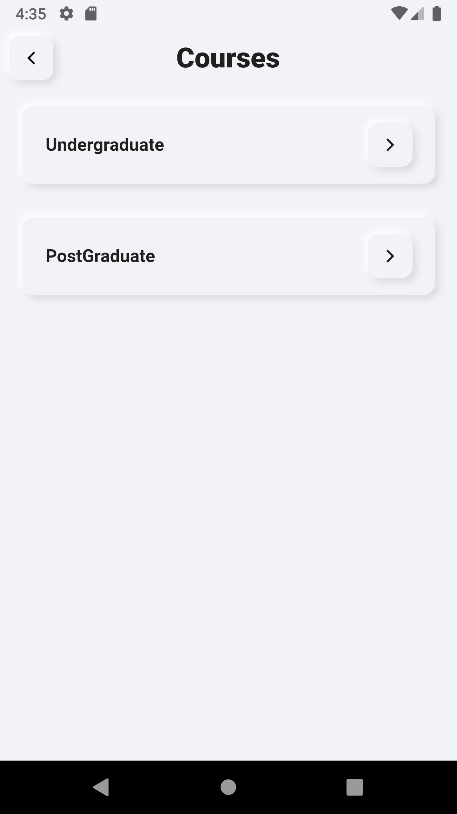
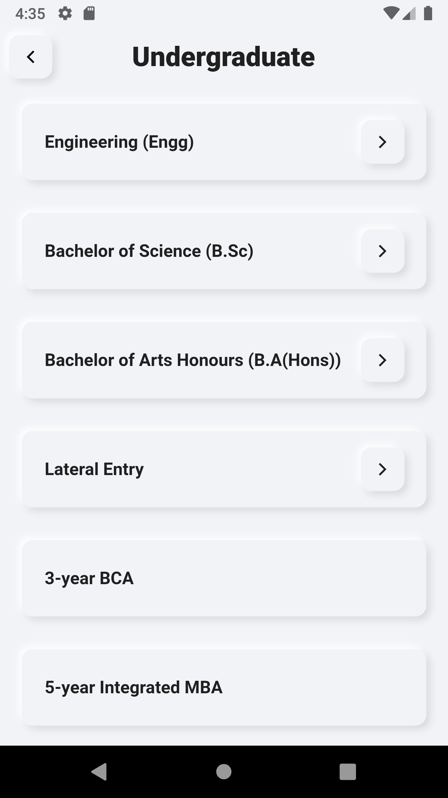
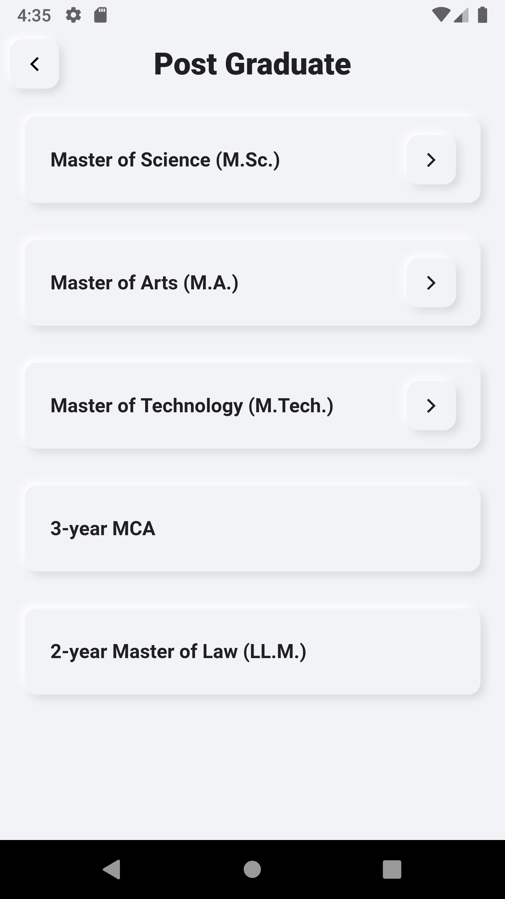

# NeuCard_Course App

A simple page transition UI made using NeuCard package

#### Flutter App Screenshots

<table>
  <tr>
    <td>Courses Page</td>
     <td>Undergraduate</td>
     <td>Postgraduate Page</td>
  </tr>
  <tr>
    <td></td>
    <td></td>
    <td></td>
  </tr>
 </table>
